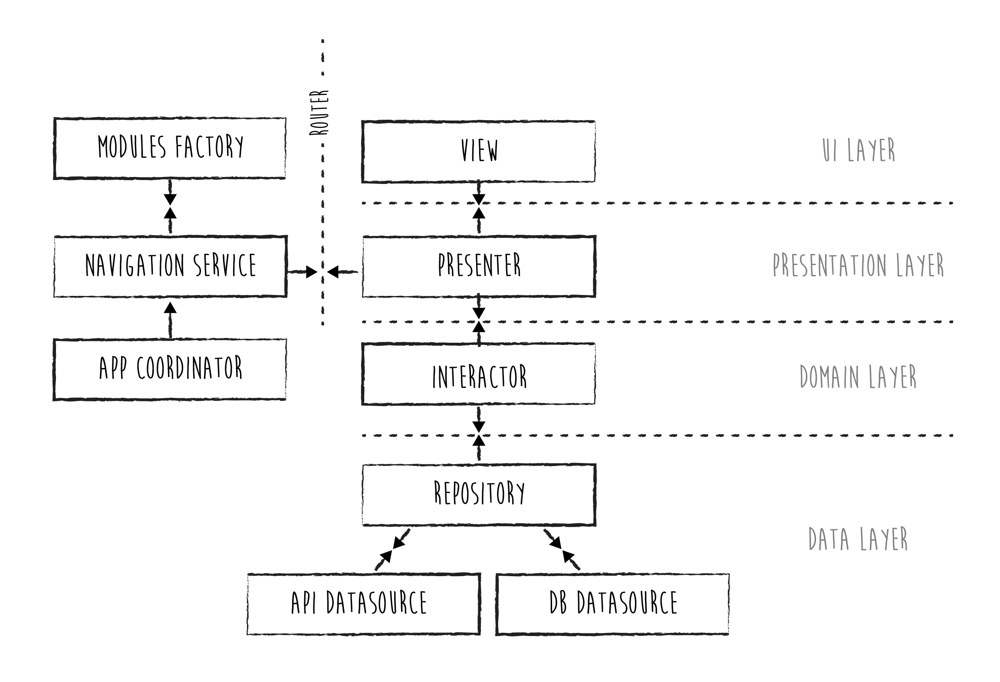

# Transactions
## Features

> Network security

 - The app uses an ephemeral session to fetch transactions, so that no sensitive data is cached on disk
 - The app uses a different session in order to fetch and cache images (URLCache)
 - No endpoint is whitelisted, so ATS applies to all connections
 
 > Data persistence
 >
 - The app persists transactions using an **encrypted** database (Realm 64-byte key backed by AES-256+SHA2)
 - The database acts as a foldback when an error is returned by the NetworkService or when the app cannot reach the network. In both cases the user is alerted that the data presented might not be up to date.

 ## Architecture
 >
 The app implements a **Viper** architecture, with a "twist": the concrete Router classes are implemented as extensions of a single **NavigationService**, common to the whole app. The NavigationService is held by an **AppCordinator**, in charge of observing and delivering events common to the whole app (e.g. in this demo, change of Reachability status) to the different modules

 The NavigationService uses a **ModulesFactory** (wireframe) in order to generate the modules. The ModulesFactory can be instantiated with different **Repositories** (data providers), e.g. ProductionRepositories/UITestsRepositories/... by using a simple flag.

The NavigationService is inspired by MVVM+C architecture and injected into  Viper architecture by conforming to the  Router protocols of the different modules.

SOLID principles are respected and a better control over navigation is achieved (IMO).

## Model types and data binding

 In the current implementation, every layer use their own Model types:
 - the DataSources (data layer) make use of their own specific **NetworkModel** (API Datasource) and **DatabaseModel** (Database Datasource) types but interface with the data layer facade (Repository) via the corresponding **DomainModel** types. 
 This allows the Repository to get data from a datasource and pass it to another without knowing the internal types that are used by the specific data sources.
This also ensures that the Repository will provide or accept a single Domain Model type to/from the upper layers of the app.
 - the domain layer (logic layer of the app) use the **DomainModel** types. The DomainModels are often simply referred to as Models in other implementations.
 - the UI layer use view-specific **Representable** types provided by the presentation layer (Presenter). DomainModels are never exposed to the UI. 

